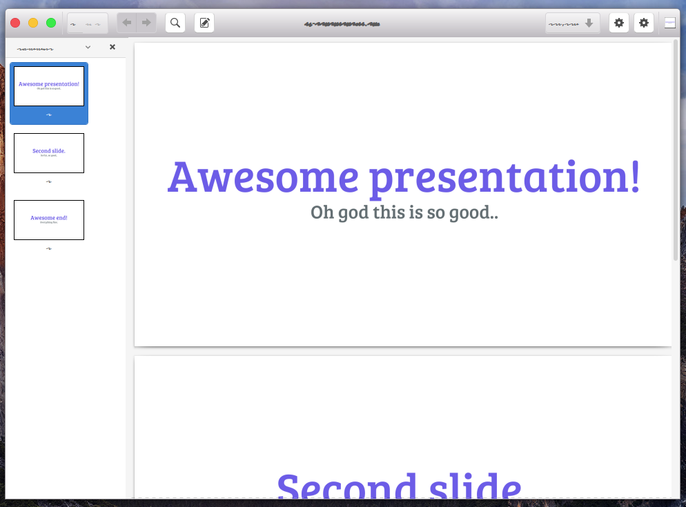

### Slidefy

> The way to create slides when you're in a hurry, but you want them to look good.

#### Installation

```sh
go get -u github.com/Halfeld/slidefy
```

### Why?

If you are a lecturer, you have probably done some lecture in a hurry because of the time, but when we do that, the slides become ugly, even doing the basics.
So the intent of this package is to create the slides just from a json!

### Usage

_My json sctruture_
```json
[
  {
    "title": "Awesome presentation!",
    "desc": "Oh god this is so good.."
  },
  {
    "title": "Second slide.",
    "desc": "So far, so good.."
  },
  {
    "title": "Awesome end!",
    "desc": "Everything fine."
  }
]
```

_Command line usage_
```
slidefy --json path/to/json.json
```

_Final pdf generated..._

